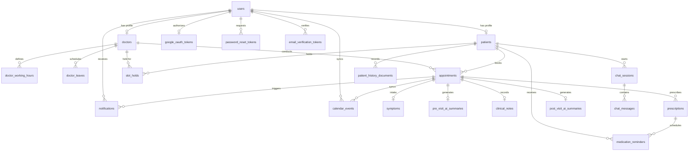

# Healthcare Appointment & Follow-up Manager — Database Schema Documentation

This document describes the complete relational database schema for the **Healthcare Appointment & Follow-up Manager** platform, implemented with PostgreSQL / SQLite via SQLAlchemy 2.0 and Alembic.

---

## 1. Entity-Relationship (ER) Diagram



---

## 2. Table Specifications

### 2.1 Identity & User Management

#### `users`
Core account table for authentication and Role-Based Access Control (RBAC).

| Column | Type | Nullable | Default | Constraints & Description |
| :--- | :--- | :--- | :--- | :--- |
| `id` | `VARCHAR(36)` | NO | `UUIDv4` | Primary Key |
| `name` | `VARCHAR(255)` | NO | — | User's full name |
| `email` | `VARCHAR(255)` | NO | — | Unique, indexed email address |
| `password_hash` | `VARCHAR(255)` | NO | — | BCrypt hashed password |
| `role` | `ENUM('PATIENT', 'DOCTOR', 'ADMIN')` | NO | — | Role for authorization |
| `is_active` | `BOOLEAN` | NO | `TRUE` | Soft active status |
| `is_email_verified`| `BOOLEAN` | NO | `FALSE` | Email verification flag |
| `created_at` | `TIMESTAMPTZ` | NO | `UTC NOW` | Audit creation timestamp |
| `updated_at` | `TIMESTAMPTZ` | NO | `UTC NOW` | Audit update timestamp |

---

#### `patients`
Profile table for registered patients.

| Column | Type | Nullable | Default | Constraints & Description |
| :--- | :--- | :--- | :--- | :--- |
| `id` | `VARCHAR(36)` | NO | `UUIDv4` | Primary Key |
| `user_id` | `VARCHAR(36)` | NO | — | Foreign Key (`users.id`), Unique |
| `date_of_birth` | `DATE` | YES | `NULL` | Patient date of birth |
| `gender` | `VARCHAR(32)` | YES | `NULL` | Gender identifier |
| `contact_information` | `VARCHAR(255)` | YES | `NULL` | Phone / Emergency contact |
| `created_at` | `TIMESTAMPTZ` | NO | `UTC NOW` | Audit creation timestamp |
| `updated_at` | `TIMESTAMPTZ` | NO | `UTC NOW` | Audit update timestamp |

---

#### `doctors`
Profile table for clinic doctors.

| Column | Type | Nullable | Default | Constraints & Description |
| :--- | :--- | :--- | :--- | :--- |
| `id` | `VARCHAR(36)` | NO | `UUIDv4` | Primary Key |
| `user_id` | `VARCHAR(36)` | NO | — | Foreign Key (`users.id`), Unique |
| `specialization` | `VARCHAR(255)` | NO | — | Clinical specialization (indexed) |
| `qualification` | `VARCHAR(255)` | YES | `NULL` | Medical degrees / credentials |
| `experience` | `INTEGER` | YES | `NULL` | Years of clinical practice |
| `slot_duration` | `INTEGER` | NO | `30` | Appointment duration in minutes |
| `is_active` | `BOOLEAN` | NO | `TRUE` | Doctor active status for bookings |
| `created_at` | `TIMESTAMPTZ` | NO | `UTC NOW` | Audit creation timestamp |
| `updated_at` | `TIMESTAMPTZ` | NO | `UTC NOW` | Audit update timestamp |

---

#### `doctor_working_hours`
Defines weekly schedule availability for each doctor.

| Column | Type | Nullable | Default | Constraints & Description |
| :--- | :--- | :--- | :--- | :--- |
| `id` | `VARCHAR(36)` | NO | `UUIDv4` | Primary Key |
| `doctor_id` | `VARCHAR(36)` | NO | — | Foreign Key (`doctors.id`), Indexed |
| `day_of_week` | `INTEGER` | NO | — | `0` = Monday .. `6` = Sunday |
| `start_time` | `TIME` | NO | — | Shift start time (e.g. `09:00:00`) |
| `end_time` | `TIME` | NO | — | Shift end time (e.g. `17:00:00`) |
| `is_active` | `BOOLEAN` | NO | `TRUE` | Active working schedule flag |

> **Unique Constraint**: `uq_doctor_day` on `(doctor_id, day_of_week)`.

---

#### `doctor_leaves`
Tracks scheduled leave dates for doctors.

| Column | Type | Nullable | Default | Constraints & Description |
| :--- | :--- | :--- | :--- | :--- |
| `id` | `VARCHAR(36)` | NO | `UUIDv4` | Primary Key |
| `doctor_id` | `VARCHAR(36)` | NO | — | Foreign Key (`doctors.id`), Indexed |
| `leave_date` | `DATE` | NO | — | Calendar date of leave (indexed) |
| `reason` | `VARCHAR(500)` | YES | `NULL` | Reason for leave |
| `created_at` | `TIMESTAMPTZ` | NO | `UTC NOW` | Audit creation timestamp |
| `updated_at` | `TIMESTAMPTZ` | NO | `UTC NOW` | Audit update timestamp |

> **Unique Constraint**: `uq_doctor_leave_date` on `(doctor_id, leave_date)`.

---

### 2.2 Scheduling & Clinical Flow

#### `appointments`
Master appointment table.

| Column | Type | Nullable | Default | Constraints & Description |
| :--- | :--- | :--- | :--- | :--- |
| `id` | `VARCHAR(36)` | NO | `UUIDv4` | Primary Key |
| `patient_id` | `VARCHAR(36)` | NO | — | Foreign Key (`patients.id`), Indexed |
| `doctor_id` | `VARCHAR(36)` | NO | — | Foreign Key (`doctors.id`), Indexed |
| `start_time` | `TIMESTAMPTZ` | NO | — | Appointment start time (indexed) |
| `end_time` | `TIMESTAMPTZ` | NO | — | Appointment end time |
| `status` | `ENUM` | NO | `SCHEDULED` | Status (see State Enums), Indexed |
| `booking_reference`| `VARCHAR(36)` | NO | `UUIDv4` | Unique booking reference |
| `created_at` | `TIMESTAMPTZ` | NO | `UTC NOW` | Audit creation timestamp |
| `updated_at` | `TIMESTAMPTZ` | NO | `UTC NOW` | Audit update timestamp |

> **Double-Booking Partial Unique Index (`uq_active_doctor_slot`)**:
> `UNIQUE (doctor_id, start_time) WHERE status IN ('SCHEDULED', 'RESCHEDULED')`
> Ensures zero double-booking at the database engine level.

---

#### `slot_holds`
Advisory temporary holds reserving a slot during patient symptom intake.

| Column | Type | Nullable | Default | Constraints & Description |
| :--- | :--- | :--- | :--- | :--- |
| `id` | `VARCHAR(36)` | NO | `UUIDv4` | Primary Key |
| `doctor_id` | `VARCHAR(36)` | NO | — | Foreign Key (`doctors.id`) |
| `patient_id` | `VARCHAR(36)` | NO | — | Foreign Key (`patients.id`) |
| `start_time` | `TIMESTAMPTZ` | NO | — | Hold start time |
| `end_time` | `TIMESTAMPTZ` | NO | — | Hold end time |
| `status` | `ENUM` | NO | `HELD` | `HELD`, `EXPIRED`, `CONFIRMED`, `RELEASED` |
| `held_at` | `TIMESTAMPTZ` | NO | — | Timestamp hold was acquired |
| `expires_at` | `TIMESTAMPTZ` | NO | — | Expiration timestamp (indexed) |
| `created_at` | `TIMESTAMPTZ` | NO | `UTC NOW` | Audit creation timestamp |
| `updated_at` | `TIMESTAMPTZ` | NO | `UTC NOW` | Audit update timestamp |

---

#### `symptoms`
Patient-reported symptoms recorded during appointment booking.

| Column | Type | Nullable | Default | Constraints & Description |
| :--- | :--- | :--- | :--- | :--- |
| `id` | `VARCHAR(36)` | NO | `UUIDv4` | Primary Key |
| `appointment_id` | `VARCHAR(36)` | NO | — | Foreign Key (`appointments.id`), Unique |
| `symptom_text` | `TEXT` | NO | — | Full textual symptom description |
| `created_at` | `TIMESTAMPTZ` | NO | `UTC NOW` | Audit creation timestamp |
| `updated_at` | `TIMESTAMPTZ` | NO | `UTC NOW` | Audit update timestamp |

---

#### `pre_visit_ai_summaries`
AI-generated clinical brief summarizing symptoms for doctor review prior to visit.

| Column | Type | Nullable | Default | Constraints & Description |
| :--- | :--- | :--- | :--- | :--- |
| `id` | `VARCHAR(36)` | NO | `UUIDv4` | Primary Key |
| `appointment_id` | `VARCHAR(36)` | NO | — | Foreign Key (`appointments.id`), Unique |
| `urgency` | `VARCHAR(16)` | YES | `NULL` | Triage level (`Low`, `Medium`, `High`) |
| `chief_complaint`| `TEXT` | YES | `NULL` | Summarized chief complaint |
| `suggested_questions` | `TEXT` | YES | `NULL` | JSON array of recommended questions |
| `model_name` | `VARCHAR(128)` | YES | `NULL` | AI model name / version |
| `status` | `VARCHAR(16)` | NO | `PENDING` | `PENDING`, `SUCCESS`, `FAILED` |
| `raw_response` | `TEXT` | YES | `NULL` | Raw LLM output for auditing |
| `created_at` | `TIMESTAMPTZ` | NO | `UTC NOW` | Audit creation timestamp |
| `updated_at` | `TIMESTAMPTZ` | NO | `UTC NOW` | Audit update timestamp |

---

#### `clinical_notes`
Doctor notes recorded during or after consultation.

| Column | Type | Nullable | Default | Constraints & Description |
| :--- | :--- | :--- | :--- | :--- |
| `id` | `VARCHAR(36)` | NO | `UUIDv4` | Primary Key |
| `appointment_id` | `VARCHAR(36)` | NO | — | Foreign Key (`appointments.id`), Unique |
| `doctor_id` | `VARCHAR(36)` | NO | — | Foreign Key (`doctors.id`) |
| `notes` | `TEXT` | NO | — | Doctor's clinical notes & diagnosis |
| `created_at` | `TIMESTAMPTZ` | NO | `UTC NOW` | Audit creation timestamp |
| `updated_at` | `TIMESTAMPTZ` | NO | `UTC NOW` | Audit update timestamp |

---

#### `prescriptions`
Prescribed medications associated with an appointment.

| Column | Type | Nullable | Default | Constraints & Description |
| :--- | :--- | :--- | :--- | :--- |
| `id` | `VARCHAR(36)` | NO | `UUIDv4` | Primary Key |
| `appointment_id` | `VARCHAR(36)` | NO | — | Foreign Key (`appointments.id`), Indexed |
| `medicine_name` | `VARCHAR(255)` | NO | — | Name of medication |
| `dosage` | `VARCHAR(128)` | NO | — | Dosage (e.g. `500mg`) |
| `frequency` | `VARCHAR(64)` | NO | — | e.g. `ONCE_DAILY`, `TWICE_DAILY` |
| `duration` | `VARCHAR(64)` | YES | `NULL` | Duration (e.g. `7 days`) |
| `instructions` | `VARCHAR(500)` | YES | `NULL` | Patient intake instructions |
| `created_at` | `TIMESTAMPTZ` | NO | `UTC NOW` | Audit creation timestamp |
| `updated_at` | `TIMESTAMPTZ` | NO | `UTC NOW` | Audit update timestamp |

---

#### `post_visit_ai_summaries`
Patient-friendly discharge summary generated from clinical notes and prescriptions.

| Column | Type | Nullable | Default | Constraints & Description |
| :--- | :--- | :--- | :--- | :--- |
| `id` | `VARCHAR(36)` | NO | `UUIDv4` | Primary Key |
| `appointment_id` | `VARCHAR(36)` | NO | — | Foreign Key (`appointments.id`), Unique |
| `summary` | `TEXT` | YES | `NULL` | Plain-language visit summary |
| `medication_schedule` | `TEXT` | YES | `NULL` | JSON-encoded schedule array |
| `follow_up_steps` | `TEXT` | YES | `NULL` | JSON-encoded follow-up actions |
| `model_name` | `VARCHAR(128)` | YES | `NULL` | AI model name / version |
| `status` | `VARCHAR(16)` | NO | `PENDING` | `PENDING`, `SUCCESS`, `FAILED` |
| `created_at` | `TIMESTAMPTZ` | NO | `UTC NOW` | Audit creation timestamp |
| `updated_at` | `TIMESTAMPTZ` | NO | `UTC NOW` | Audit update timestamp |

---

### 2.3 Messaging, Calendar & Notifications

#### `google_oauth_tokens`
Stores OAuth 2.0 access & refresh tokens for Google Calendar sync.

| Column | Type | Nullable | Default | Constraints & Description |
| :--- | :--- | :--- | :--- | :--- |
| `id` | `VARCHAR(36)` | NO | `UUIDv4` | Primary Key |
| `user_id` | `VARCHAR(36)` | NO | — | Foreign Key (`users.id`), Unique |
| `access_token` | `TEXT` | NO | — | Current Google OAuth access token |
| `refresh_token` | `TEXT` | YES | `NULL` | Offline refresh token |
| `token_expiry` | `TIMESTAMPTZ` | YES | `NULL` | Access token expiration timestamp |
| `created_at` | `TIMESTAMPTZ` | NO | `UTC NOW` | Audit creation timestamp |
| `updated_at` | `TIMESTAMPTZ` | NO | `UTC NOW` | Audit update timestamp |

---

#### `calendar_events`
Tracks synchronization status of appointments to Google Calendar.

| Column | Type | Nullable | Default | Constraints & Description |
| :--- | :--- | :--- | :--- | :--- |
| `id` | `VARCHAR(36)` | NO | `UUIDv4` | Primary Key |
| `appointment_id` | `VARCHAR(36)` | NO | — | Foreign Key (`appointments.id`) |
| `user_id` | `VARCHAR(36)` | NO | — | Foreign Key (`users.id`) |
| `role` | `VARCHAR(16)` | NO | — | `PATIENT` or `DOCTOR` |
| `provider` | `ENUM('GOOGLE')`| NO | `GOOGLE` | Calendar service provider |
| `external_event_id` | `VARCHAR(255)`| YES | `NULL` | Google Calendar event ID |
| `status` | `ENUM` | NO | `PENDING` | `PENDING`, `SYNCED`, `SYNC_PENDING`, `FAILED`, `DELETED` |
| `last_error` | `VARCHAR(500)` | YES | `NULL` | Error details on sync failure |
| `created_at` | `TIMESTAMPTZ` | NO | `UTC NOW` | Audit creation timestamp |
| `updated_at` | `TIMESTAMPTZ` | NO | `UTC NOW` | Audit update timestamp |

> **Index**: `ix_calendar_events_appt_user` on `(appointment_id, user_id)`.

---

#### `notifications`
Audit and retry queue for transactional email notifications.

| Column | Type | Nullable | Default | Constraints & Description |
| :--- | :--- | :--- | :--- | :--- |
| `id` | `VARCHAR(36)` | NO | `UUIDv4` | Primary Key |
| `user_id` | `VARCHAR(36)` | NO | — | Foreign Key (`users.id`) |
| `appointment_id` | `VARCHAR(36)` | YES | `NULL` | Foreign Key (`appointments.id`) |
| `notification_type`| `ENUM` | NO | — | See NotificationType Enum |
| `recipient` | `VARCHAR(255)` | NO | — | Email address at send time |
| `status` | `ENUM` | NO | `PENDING` | `PENDING`, `PROCESSING`, `SENT`, `FAILED` |
| `attempt_count` | `INTEGER` | NO | `0` | Retry counter |
| `last_error` | `VARCHAR(500)` | YES | `NULL` | Error description if send failed |
| `scheduled_at` | `TIMESTAMPTZ` | NO | — | Time notification is queued for |
| `sent_at` | `TIMESTAMPTZ` | YES | `NULL` | Actual delivery timestamp |
| `created_at` | `TIMESTAMPTZ` | NO | `UTC NOW` | Audit creation timestamp |
| `updated_at` | `TIMESTAMPTZ` | NO | `UTC NOW` | Audit update timestamp |

---

#### `medication_reminders`
Scheduled patient medication reminders.

| Column | Type | Nullable | Default | Constraints & Description |
| :--- | :--- | :--- | :--- | :--- |
| `id` | `VARCHAR(36)` | NO | `UUIDv4` | Primary Key |
| `prescription_id`| `VARCHAR(36)` | NO | — | Foreign Key (`prescriptions.id`) |
| `patient_id` | `VARCHAR(36)` | NO | — | Foreign Key (`patients.id`) |
| `scheduled_at` | `TIMESTAMPTZ` | NO | — | Reminder execution timestamp (indexed) |
| `status` | `ENUM` | NO | `PENDING` | `PENDING`, `PROCESSING`, `SENT`, `FAILED` |
| `attempt_count` | `INTEGER` | NO | `0` | Retry attempts |
| `last_error` | `VARCHAR(500)` | YES | `NULL` | Error details |
| `sent_at` | `TIMESTAMPTZ` | YES | `NULL` | Delivery timestamp |
| `created_at` | `TIMESTAMPTZ` | NO | `UTC NOW` | Audit creation timestamp |
| `updated_at` | `TIMESTAMPTZ` | NO | `UTC NOW` | Audit update timestamp |

---

### 2.4 AI Chat & RAG Vector Metadata

#### `chat_sessions`
Sessions for patient conversational AI assistant.

| Column | Type | Nullable | Default | Constraints & Description |
| :--- | :--- | :--- | :--- | :--- |
| `id` | `VARCHAR(36)` | NO | `UUIDv4` | Primary Key |
| `patient_id` | `VARCHAR(36)` | NO | — | Foreign Key (`patients.id`), Indexed |
| `status` | `VARCHAR(16)` | NO | `ACTIVE` | Session status |
| `created_at` | `TIMESTAMPTZ` | NO | `UTC NOW` | Audit creation timestamp |
| `updated_at` | `TIMESTAMPTZ` | NO | `UTC NOW` | Audit update timestamp |

---

#### `chat_messages`
Individual turns in a chat session.

| Column | Type | Nullable | Default | Constraints & Description |
| :--- | :--- | :--- | :--- | :--- |
| `id` | `VARCHAR(36)` | NO | `UUIDv4` | Primary Key |
| `session_id` | `VARCHAR(36)` | NO | — | Foreign Key (`chat_sessions.id`), Indexed |
| `role` | `VARCHAR(16)` | NO | — | `user`, `assistant`, `tool` |
| `message` | `TEXT` | NO | — | Message text content |
| `created_at` | `TIMESTAMPTZ` | NO | `UTC NOW` | Audit creation timestamp |
| `updated_at` | `TIMESTAMPTZ` | NO | `UTC NOW` | Audit update timestamp |

---

#### `patient_history_documents`
PostgreSQL durable record mirroring embeddings indexed in ChromaDB for Retrieval-Augmented Generation (RAG).

| Column | Type | Nullable | Default | Constraints & Description |
| :--- | :--- | :--- | :--- | :--- |
| `id` | `VARCHAR(36)` | NO | `UUIDv4` | Primary Key |
| `patient_id` | `VARCHAR(36)` | NO | — | Foreign Key (`patients.id`), Indexed |
| `appointment_id` | `VARCHAR(36)` | YES | `NULL` | Foreign Key (`appointments.id`) |
| `document_type` | `VARCHAR(64)` | NO | — | `symptom`, `clinical_note`, `prescription`, `summary` |
| `source_text` | `TEXT` | NO | — | Raw clinical text vectorized |
| `doc_metadata` | `TEXT` | YES | `NULL` | JSON-encoded vector metadata |
| `created_at` | `TIMESTAMPTZ` | NO | `UTC NOW` | Audit creation timestamp |
| `updated_at` | `TIMESTAMPTZ` | NO | `UTC NOW` | Audit update timestamp |

---

### 2.5 Security & Single-Use Tokens

#### `password_reset_tokens`
Cryptographically secure, single-use, hashed password reset tokens.

| Column | Type | Nullable | Default | Constraints & Description |
| :--- | :--- | :--- | :--- | :--- |
| `id` | `VARCHAR(36)` | NO | `UUIDv4` | Primary Key |
| `user_id` | `VARCHAR(36)` | NO | — | Foreign Key (`users.id`), Indexed |
| `token_hash` | `VARCHAR(64)` | NO | — | SHA-256 hash of token (Unique, Indexed) |
| `expires_at` | `TIMESTAMPTZ` | NO | — | Expiration timestamp |
| `used_at` | `TIMESTAMPTZ` | YES | `NULL` | Timestamp token was consumed |
| `created_at` | `TIMESTAMPTZ` | NO | `UTC NOW` | Audit creation timestamp |
| `updated_at` | `TIMESTAMPTZ` | NO | `UTC NOW` | Audit update timestamp |

---

#### `email_verification_tokens`
Cryptographically secure, single-use, hashed email verification tokens.

| Column | Type | Nullable | Default | Constraints & Description |
| :--- | :--- | :--- | :--- | :--- |
| `id` | `VARCHAR(36)` | NO | `UUIDv4` | Primary Key |
| `user_id` | `VARCHAR(36)` | NO | — | Foreign Key (`users.id`), Indexed |
| `token_hash` | `VARCHAR(64)` | NO | — | SHA-256 hash of token (Unique, Indexed) |
| `expires_at` | `TIMESTAMPTZ` | NO | — | Expiration timestamp |
| `used_at` | `TIMESTAMPTZ` | YES | `NULL` | Timestamp token was consumed |
| `created_at` | `TIMESTAMPTZ` | NO | `UTC NOW` | Audit creation timestamp |
| `updated_at` | `TIMESTAMPTZ` | NO | `UTC NOW` | Audit update timestamp |

---

## 3. Enumeration Reference

```python
class UserRole(str, Enum):
    PATIENT = "PATIENT"
    DOCTOR = "DOCTOR"
    ADMIN = "ADMIN"

class AppointmentStatus(str, Enum):
    SCHEDULED = "SCHEDULED"
    RESCHEDULED = "RESCHEDULED"
    CANCELLED = "CANCELLED"
    COMPLETED = "COMPLETED"
    RESCHEDULE_REQUIRED = "RESCHEDULE_REQUIRED"

class HoldStatus(str, Enum):
    HELD = "HELD"
    EXPIRED = "EXPIRED"
    CONFIRMED = "CONFIRMED"
    RELEASED = "RELEASED"

class NotificationStatus(str, Enum):
    PENDING = "PENDING"
    PROCESSING = "PROCESSING"
    SENT = "SENT"
    FAILED = "FAILED"

class NotificationType(str, Enum):
    BOOKING_CONFIRMATION = "BOOKING_CONFIRMATION"
    REMINDER = "REMINDER"
    CANCELLATION = "CANCELLATION"
    RESCHEDULE = "RESCHEDULE"
    LEAVE_CONFLICT = "LEAVE_CONFLICT"
    MEDICATION_REMINDER = "MEDICATION_REMINDER"

class CalendarEventStatus(str, Enum):
    PENDING = "PENDING"
    SYNCED = "SYNCED"
    SYNC_PENDING = "SYNC_PENDING"
    FAILED = "FAILED"
    DELETED = "DELETED"
```
